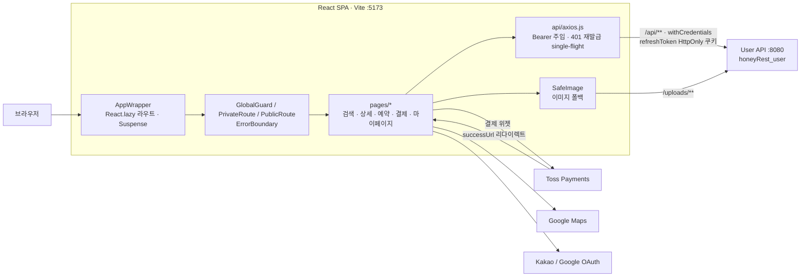
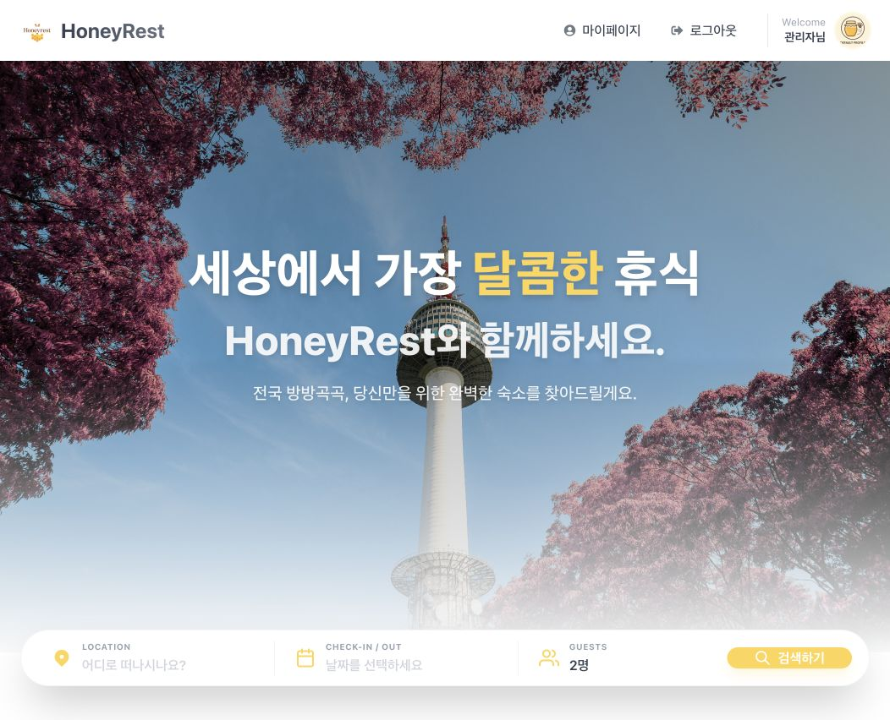
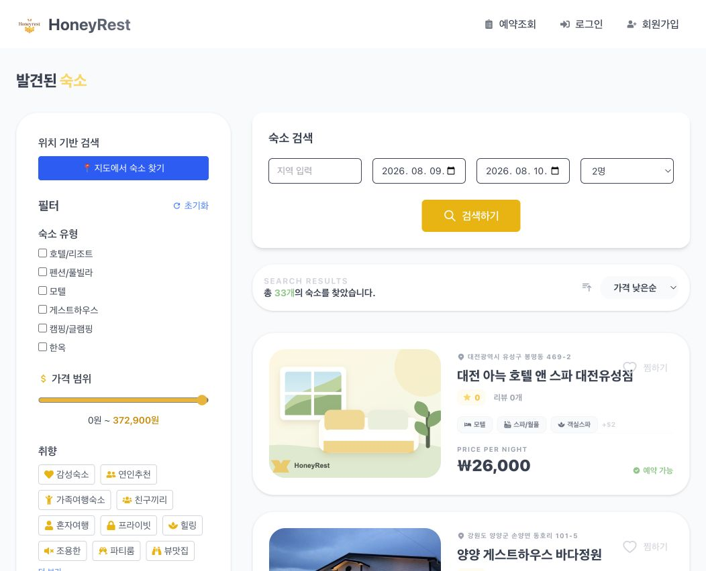
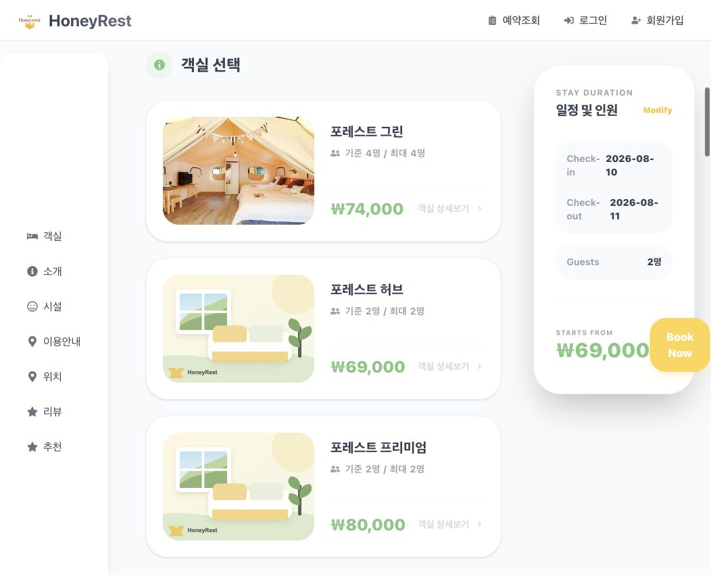
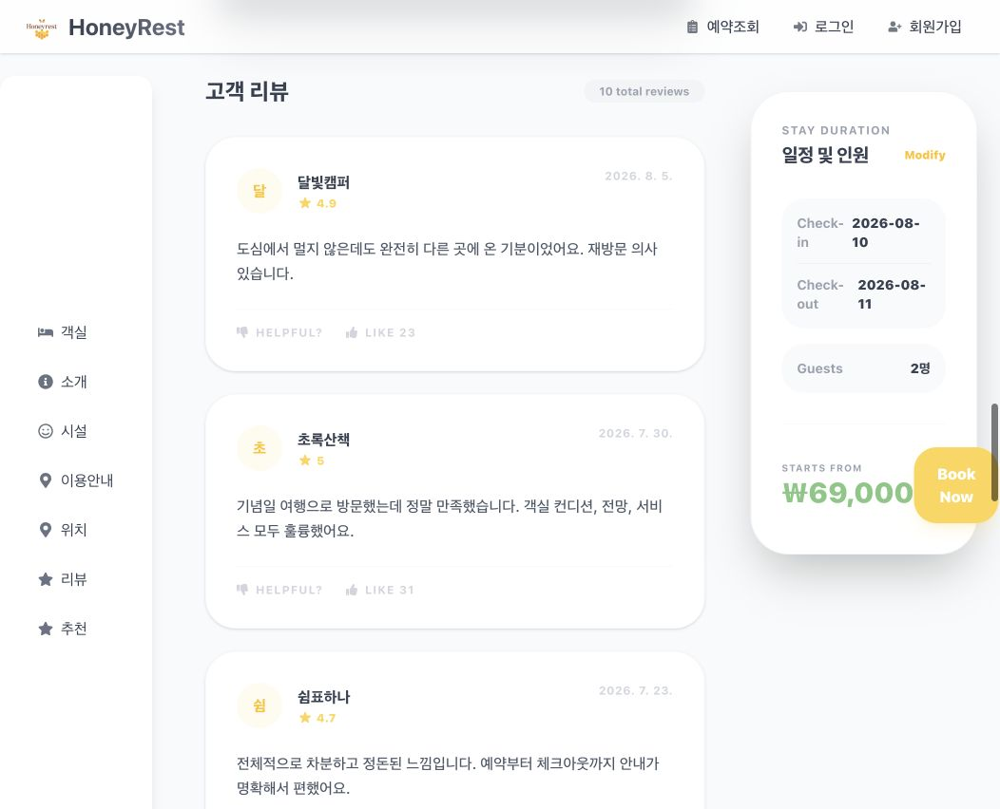
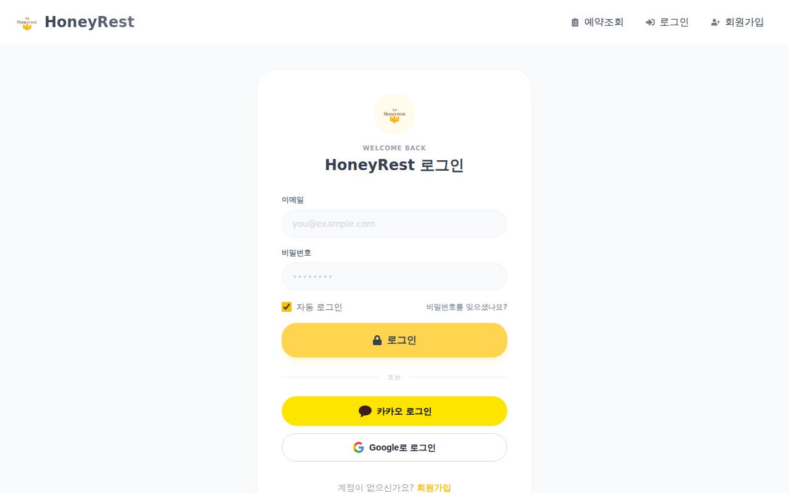
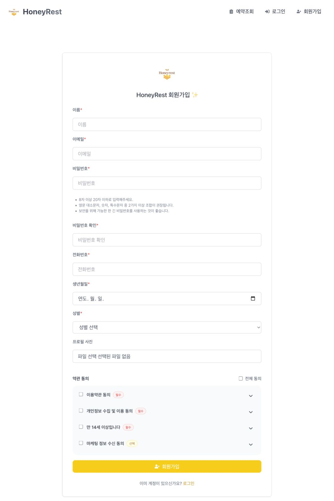
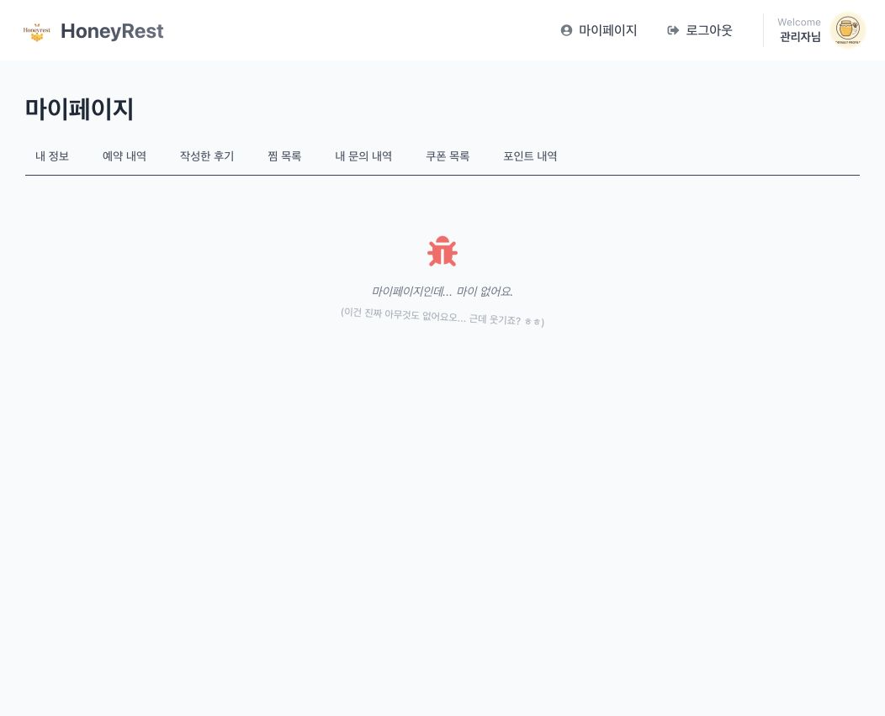

# HoneyRest – 숙소 예약 플랫폼 · 사용자 프론트엔드

[](https://github.com/Seongwonp/honeyrest_user_react/actions/workflows/ci.yml)


**HoneyRest**의 사용자 화면 SPA입니다. 지역·날짜·인원 검색과 지도 검색, 숙소·객실 상세, 쿠폰·포인트를 적용한 예약, 토스 결제, 리뷰, 마이페이지(예약·찜·쿠폰·포인트·1:1 문의)까지 사용자 흐름 전체를 React로 구현했습니다.
팀 프로젝트(2025.08) 이후 결제 승인 중복 호출 차단, 직접 진입 크래시 방지, 이미지 폴백, 번들 분할(메인 청크 6.3MB → 600KB)을 단독으로 보강했습니다.

| 저장소 | 역할 |
|--------|------|
| [honeyRest_user](https://github.com/Seongwonp/honeyRest_user) | 사용자 REST API · Spring Boot |
| **honeyrest_user_react** (현재) | 사용자 화면 · React 19 SPA |
| [honeyRest_host](https://github.com/Seongwonp/honeyRest_host) | 업체 관리자 / 총관리자 화면 · Spring Boot + Thymeleaf |

---

## 역할

**팀 프로젝트 (2025.08.04 ~ 2025.09.04, 4주, 3명)**

| 이름 | 담당 |
|------|------|
| 박성원 (팀장) | 사용자(User) 영역 총괄 — 이 React 앱과 User API 전체 설계·개발 / DB 설계 및 ERD 작성 / API 명세서 작성 / 광고 영상·일러스트 제작 / 발표 PPT 기획·디자인 |
| 김민경 | 업체 관리자(Company Admin) 시스템 개발 ([honeyRest_host](https://github.com/Seongwonp/honeyRest_host)) |
| 설현오 | 총 관리자(Super Admin) 시스템 개발 ([honeyRest_host](https://github.com/Seongwonp/honeyRest_host)) |

**프로젝트 종료 후 단독 고도화 (2025.09 ~ , 박성원)**

- **안정성**: 전역 `ErrorBoundary`, `/reserve`·결제 페이지 새로고침/직접 진입 시 백지 화면 → 안전한 리다이렉트
- **API 계층 통일**: 인터셉터 없는 원본 axios를 쓰던 11개 파일을 공용 `api` 인스턴스로 전환(JWT 주입·재발급·에러 처리 일괄 적용)
- **결제 멱등**: 결제 성공 페이지의 승인 API 중복 호출 차단, 예약 금액은 서버 계산값 사용, 진행 중 버튼 비활성화
- **이미지**: 만료된 Firebase URL·삭제된 이미지를 `SafeImage` 종류별 대체 이미지로 처리, Firebase SDK 제거, `/uploads` 프록시
- **성능**: 아이콘 팩 전체 import → 명시적 매핑, 라우트 `React.lazy` 분할 → 메인 청크 6,333KB → 600KB
- **품질**: 하드코딩 localhost → 환경변수, react-hooks 의존성 경고 16건 정리(lint 0 오류 0 경고), GitHub Actions CI
- 상세 기록: [docs/STABILIZATION.md](docs/STABILIZATION.md)

---

## 기술 스택

| 구분 | 기술 |
|------|------|
| 런타임 / 빌드 | Node.js ≥ 20.19, Vite 7 (`loadEnv`, `/api`·`/uploads` 개발 프록시) |
| UI | React 19, React Router DOM 7 (중첩 라우트, `React.lazy` + `Suspense`), Tailwind CSS 4 (`@theme`) |
| HTTP | Axios 1.x — 공용 인스턴스, JWT 주입, 401 시 토큰 재발급 후 재시도 |
| 결제 | `@tosspayments/tosspayments-sdk` 2.x (결제 위젯) |
| 지도 | `@vis.gl/react-google-maps` |
| 날짜 | react-date-range, date-fns, dayjs |
| UI 부가 | Framer Motion, AOS, react-slick, React Toastify, SweetAlert2, React Icons, weather-icons |
| 품질 / CI | ESLint 9 (react-hooks, react-refresh), GitHub Actions |

---

## 아키텍처



- 결제 흐름: `/reserve`(서버가 계산한 금액으로 예약 폼) → `/payment/process`(토스 위젯) → `/payment/success`(승인 API 1회 호출) → 서버가 재검증·저장, 실패 시 결제 자동 취소
- 인증 흐름: access token은 `localStorage`(로그인 유지) 또는 `sessionStorage`, refresh token은 서버가 내려준 HttpOnly 쿠키. JWT `exp`를 파싱해 만료 시 자동 로그아웃

---

## 핵심 설계 결정 & 트러블슈팅

### 1. 메인 번들 6.3MB — 아이콘 매핑 + 라우트 분할
- **문제**: 서버가 내려주는 태그 아이콘 이름(`FaWifi` 등)을 그리기 위해 `import * as FaIcons/MdIcons/RiIcons`로 아이콘 팩 전체를 가져와 트리 셰이킹이 불가능했고, 모든 페이지가 하나의 청크에 들어 있었습니다.
- **결정**: 실제 쓰는 아이콘만 명시적으로 import한 `TAG_ICONS` 매핑으로 교체(새 아이콘은 목록에 추가해야 표시되는 트레이드오프를 주석으로 명시). 페이지 라우트는 `React.lazy` + `Suspense`(`PageLoader`)로 분할했습니다.
- **결과**: 메인 청크 **6,333KB → 600KB**.
- 코드: [`src/utils/tagIcons.js`](src/utils/tagIcons.js) · [`src/AppWrapper.jsx`](src/AppWrapper.jsx)

### 2. 결제 승인 API 중복 호출 — 결제 성공 페이지 멱등 처리
- **문제**: 토스가 리다이렉트한 `/payment/success`는 새로고침·뒤로가기·개발 모드의 effect 이중 실행마다 승인 API를 다시 호출할 수 있어, 서버에 중복 승인 요청이 쌓이고 사용자는 실패 화면을 보게 될 수 있었습니다.
- **결정**: 모듈 단위 진행 중 Promise 맵으로 같은 주문의 동시 호출을 하나로 합치고, `useRef`로 컴포넌트당 1회만 요청, 서버가 응답한 결과(성공·409 매진·5xx 결제 취소)는 `sessionStorage`에 저장해 재진입 시 API 없이 결과를 보여줍니다. 응답이 없는 네트워크 오류는 결과를 알 수 없으므로 저장하지 않고, 예약 임시 정보는 승인 확정 후에만 지웁니다.
- **결과**: 프론트 1회 호출 + 서버의 `paymentKey`·예약번호 중복 검사(409)로 이중 방어. 실패 시 서버 메시지와 복귀 경로를 표시합니다.
- 코드: [`src/pages/Payment/PaymentSuccess.jsx`](src/pages/Payment/PaymentSuccess.jsx)

### 3. 동시 401에서 재발급 폭주 — single-flight 재발급 인터셉터
- **문제**: access token 만료 시점에 여러 요청이 동시에 401을 받으면 각각 `/api/auth/refresh`를 호출했고, 일부 화면은 인터셉터가 없는 원본 axios를 써서 재발급·배포 API 주소 설정을 아예 우회했습니다.
- **결정**: 진행 중인 재발급 Promise(`refreshPromise`)를 공유해 재발급은 한 번만 하고, `_retry` 플래그로 요청당 1회만 재시도. 재발급 자체가 401이면 로그아웃. 원본 axios를 쓰던 11개 파일을 공용 `api` 인스턴스로 전환(외부 공공데이터 API 호출만 예외).
- **결과**: 인증·에러 처리 경로가 하나로 모였습니다. 트레이드오프: access token을 Web Storage에 두므로 XSS에 노출될 수 있어 access token 수명을 1시간으로 두고 refresh token(7일)은 JS에서 읽을 수 없는 HttpOnly 쿠키로 분리했습니다.
- 코드: [`src/api/axios.js`](src/api/axios.js) · [`src/hooks/useAuth.js`](src/hooks/useAuth.js)

### 4. 새로고침하면 백지 화면 — `location.state` 가드 + ErrorBoundary
- **문제**: `/reserve`, `/payment/process`가 이전 페이지에서 넘긴 `location.state`를 무가드 구조분해해, 새로고침·URL 직접 진입 시 렌더링 예외로 앱 전체가 백지가 됐습니다.
- **결정**: state가 없으면 숙소 목록 등 안전한 경로로 `replace` 리다이렉트하고, 처리되지 않은 렌더링 예외는 전역 `ErrorBoundary`가 받아 복귀 버튼이 있는 안내 화면을 보여줍니다.
- **결과**: 주요 예약·결제 경로의 직접 진입이 복구 가능한 흐름이 됐습니다.
- 코드: [`src/pages/Reservation/Reservation.jsx`](src/pages/Reservation/Reservation.jsx) · [`src/components/ErrorBoundary.jsx`](src/components/ErrorBoundary.jsx)

### 5. 깨진 이미지 — `SafeImage` 폴백과 Firebase 제거
- **문제**: 초기 데이터 이미지가 Firebase Storage URL이라 토큰 만료·파일 삭제 시 깨진 이미지가 그대로 노출됐고, 프론트에도 Firebase SDK가 남아 있었습니다.
- **결정**: 서버 이미지를 모두 `SafeImage`로 교체 — `src`가 비었거나 로딩에 실패하면 `kind`(숙소·객실·프로필·이벤트)별 SVG 대체 이미지로 전환(무한 onError 루프 방지). 백엔드가 로컬 저장소 모드일 때를 위해 Vite 프록시에 `/uploads`를 추가하고 Firebase SDK는 제거했습니다.
- **결과**: 외부 저장소 상태와 무관하게 레이아웃이 유지됩니다.
- 코드: [`src/components/SafeImage.jsx`](src/components/SafeImage.jsx) · [`vite.config.js`](vite.config.js)

### 6. 화면 금액과 결제 금액 불일치 — 서버 계산값 사용
- **문제**: 예약 화면이 클라이언트에서 금액을 계산해, 날짜별 요금이 반영된 서버 금액과 달라지면 결제 검증에서 거절될 수 있었습니다.
- **결정**: 예약 폼은 서버(`PriceCalculator`)가 계산한 `originalPrice`를 표시·제출하고, 예약·결제 버튼은 진행 중 비활성화해 중복 클릭을 막습니다.
- **결과**: 화면 금액 = 토스 요청 금액 = 서버 검증 금액.
- 코드: [`src/pages/Reservation/Reservation.jsx`](src/pages/Reservation/Reservation.jsx) · [`src/pages/Payment/PaymentProcess.jsx`](src/pages/Payment/PaymentProcess.jsx)

---

## 실행 방법

```bash
node --version        # 20.19.0 이상 (nvm use 20, .nvmrc 참고)
npm install
cp .env.example .env  # 값 채우기
npm run dev           # http://localhost:5173
```

| 환경변수 | 설명 |
|----------|------|
| `VITE_BACKEND_URL` | User API 주소 (예: `http://localhost:8080`). `/api`, `/uploads` 프록시 대상 |
| `VITE_ADMIN_URL` | 관리자 앱 주소 (예: `http://localhost:8081`). 비우면 헤더의 관리자 버튼 숨김 |
| `VITE_OAUTH_REDIRECT_URI` | OAuth 콜백 기준 URL. 비우면 `window.location.origin` |
| `VITE_KAKAO_CLIENT_ID`, `VITE_GOOGLE_CLIENT_ID` | 소셜 로그인 |
| `VITE_APP_GOOGLE_MAPS_KEY`, `VITE_GOOGLE_MAP_ID` | Google Maps |
| `VITE_TOSS_WIDGET_CLIENT_KEY` | 토스 결제 위젯 클라이언트 키 (테스트 키 사용 권장) |
| `VITE_HOLIDAY_API_KEY` | 공휴일 API |

- 백엔드: [User API](https://github.com/Seongwonp/honeyRest_user)를 `8080`에서 실행해야 합니다. 로컬 저장소 모드(`app.storage.type=local`)와 데이터 시드 방법은 해당 README의 "실행 방법"을 참고하세요.
- 데모 계정: 사용자는 회원가입으로 생성합니다. 관리자 데모 계정은 관리자 저장소의 `local-demo` 프로필에서 [`DataInitializer`](https://github.com/Seongwonp/honeyRest_host/blob/main/src/main/java/com/honeyrest/honeyrest_host/config/DataInitializer.java)가 생성합니다.

```bash
npm run build     # 프로덕션 빌드
npm run preview   # 빌드 결과 미리보기
npm run lint      # ESLint
```

---

## 테스트 & CI

- 자동화된 단위·E2E 테스트는 아직 없습니다. 품질 게이트는 **ESLint(0 오류 0 경고)와 프로덕션 빌드**이며, 핵심 흐름은 브라우저 회귀 점검으로 확인했습니다([STABILIZATION.md](docs/STABILIZATION.md)).
- **CI**: [GitHub Actions](.github/workflows/ci.yml) — `master` push/PR마다 `.nvmrc` 기준 Node로 `npm ci` → `npm run lint` → `npm run build`
- 결제·재고·권한 로직의 자동 테스트는 백엔드 저장소에 있습니다(User API 77개, 관리자 52개).

---

## 화면

### 메인 홈



[메인 홈 전체 화면 보기](docs/screenshots/home-full.png)

### 숙소 검색

가격 캘린더가 적용된 숙소 검색과, 이미지 로드 실패 시 로컬 대체 이미지가 표시되는 모습입니다.



### 숙소 상세 · 객실 선택



### 고객 리뷰



### 로그인 · 회원가입

| 로그인 | 회원가입 |
|---|---|
|  |  |

### 마이페이지



- 시연 영상: 추후 GitHub Release에 첨부 예정
- 발표 자료: [HoneyRest.pdf](https://github.com/user-attachments/files/22292418/HoneyRest.pdf)

<details>
<summary>프로젝트 구조</summary>

```
src/
├── api/            axios.js (공용 인스턴스·인터셉터), useApiRequest.js (로딩·재시도·AbortController)
├── components/     Header, Layout, Modal, SafeImage, ErrorBoundary, PageLoader ...
├── config/         urls.js (환경변수 기반 URL)
├── hooks/          useAuth.js (로그인 상태·스토리지 동기화)
├── routes/         PrivateRoute, PublicRoute
├── utils/          tagIcons.js (태그 아이콘 매핑)
├── pages/
│   ├── Home/            배너·검색·추천·이벤트·날씨
│   ├── Accommodations/  목록·상세·객실·지도 검색
│   ├── Reservation/     예약 폼, 비회원 예약 조회
│   ├── Payment/         토스 위젯, 성공·실패
│   ├── Login/ SignUp/   일반 + Kakao/Google OAuth, 이메일 인증
│   ├── Review/          리뷰 작성
│   ├── myPage/          프로필·예약·리뷰·찜·문의·쿠폰·포인트 (중첩 라우트)
│   └── Error/           400/401/403/404/408/422/429/500/503
├── App.jsx         BrowserRouter + GlobalGuard + ErrorBoundary
└── AppWrapper.jsx  전체 Route 정의 (React.lazy)
```

</details>

---

## 회고

- [프로젝트 회고 (honeyRest_user/docs/RETROSPECTIVE.md)](https://github.com/Seongwonp/honeyRest_user/blob/main/docs/RETROSPECTIVE.md)

---

**박성원 (Seongwon Park)** · 팀장 / 사용자 영역 총괄 · [GitHub](https://github.com/Seongwonp)
